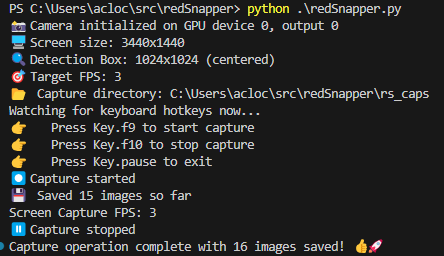

# 📷💾🧠 redSnapper
A rapid screenshot utility using [BetterCam](https://github.com/RootKit-Org/BetterCam) to speed up my generation screenshots to be used in [YOLO](https://www.ultralytics.com/yolo) training data sets

## Why?
I needed something to quickly capture what was going on at variable frame rates and also wanted to play around with Python a bit more.

### No, Why "Red Snapper"?!
Well, it went something like this...
* I need something to take rapid screenshots at variable rates
* Screenshots are sort of snapshots
* I really only want what's in a specific _box_ on the screen
* Snapshots -> snap... what's in the box...
* ...[UHF](https://www.youtube.com/watch?v=KezvwARhBIc)...

LESSON: I should never be in charge of naming things 🙃

## Theory
I have a longer-term project in the works which involves training YOLO on some objects in a first person shooter game I play.  
The game runs on my computer at > 300fps and I thought I'd want to capture around 60fps to quickly generate images for tagging and training.  
This turned out to be a **terrible** plan because there just isn't enough movement of objects between images when capturing at 60fps and I realized I'd probably introduce bias in the trained model to the non-diverse images in the set and/or I'd spend the rest of my life tagging images.  
Thus, I decided it would be best to drop the fps way down and start capturing a few frames per second so that more changes per frame but I thought I'd stick with the setup that could do 60+ fps because... why not?

The basic idea is that the capture class runs on it's own as BetterCam is already setup for speed. Image writing is done in another thread so it's non-blocking and pynput handles hotkey monitoring in a distinct thread as well.  
I tried to keep things fairly SOLID, so _in theory_ I should be able to reuse the `keymon` and `snapper` classes in future work. 🤷

### Setup
1. If not already done, create a virtual env: `python -m venv .venv` 
1. Activate venv: (Win) `.venv\Scripts\activate`
1. Install requirements: `pip install -r requirements.txt`

## Running
On Windows run: `python redSnapper.py` then use the hotkeys to start/stop/exit

### TODOs
1. Add a simple config file loader, probably leverage a `config.default` and then if `config.ini` exists, use that instead (add `config.ini` to `.gitignore`)
1. Once config is added, make directory, file prefix, hot keys, frame rate, detection area all configurable

